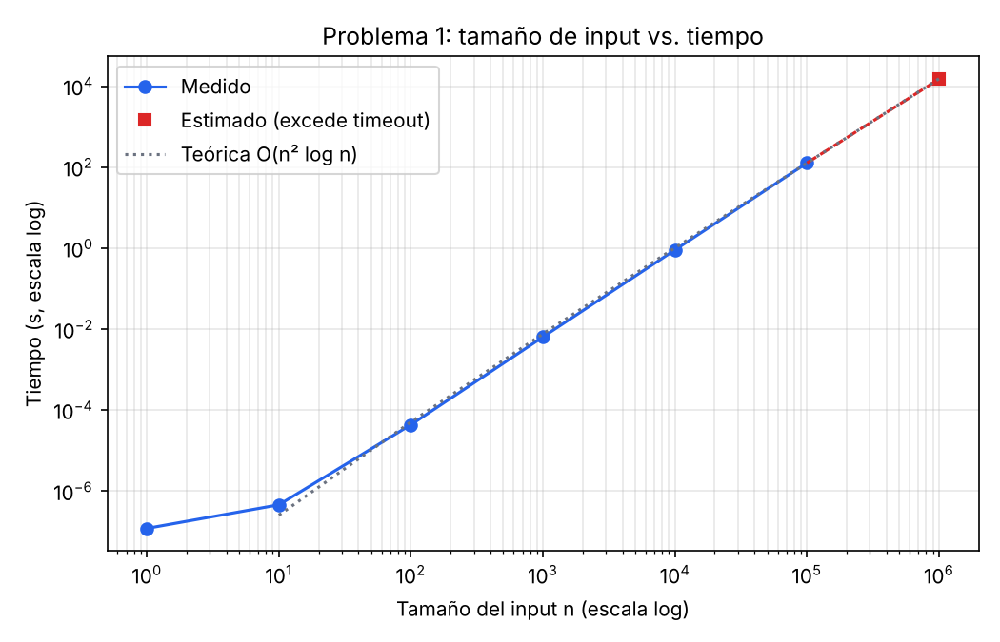
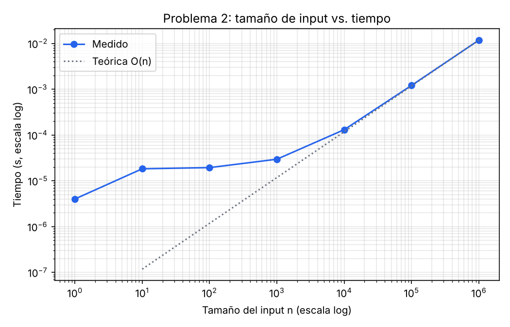
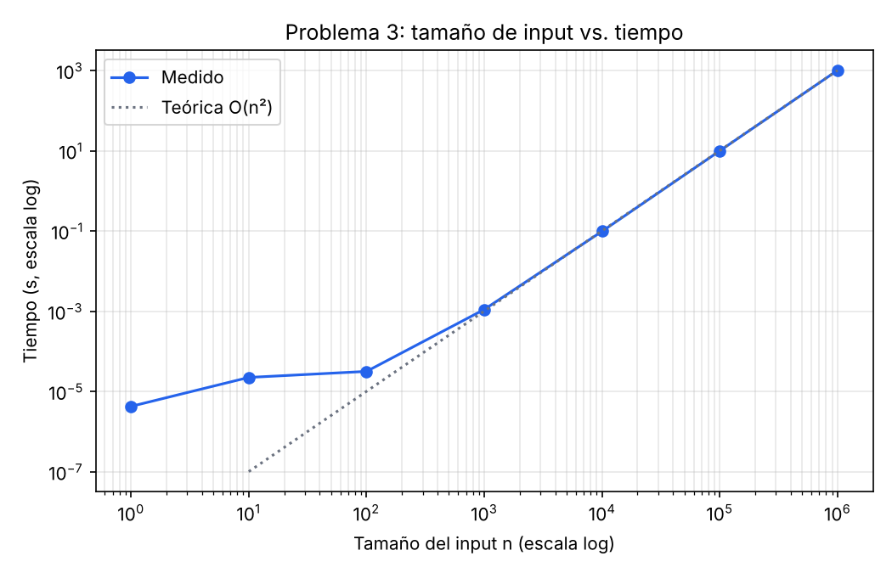

# Laboratorio 8 — Teoría de la Computación

Análisis de complejidad (Big-O) y profiling de algoritmos.

📹 **Video de ejecución:** [YouTube (no listado)](PEGAR_ENLACE_AQUI)

## Estructura

```
.
├── src/
│   ├── problema1.c        # Problema 1: tres ciclos anidados, O(n² log n)
│   ├── problema2.c        # Problema 2: ciclo con break, O(n)
│   ├── problema3.c        # Problema 3: ciclos n/3 × n/4, O(n²)
│   └── problema5c.py      # Verificación empírica del problema 5c
├── profiling.py           # Corre los programas, genera tablas y gráficas
├── resultados/            # CSV, tablas .md y gráficas .png generadas
├── respuestas/
│   ├── respuestas.pdf     # Partes a (P1–P3), problema 4 y problema 5
│   └── respuestas.tex     # Fuente LaTeX del PDF
└── Makefile
```

## Requisitos

- `gcc` y `make`
- Python 3 con `matplotlib` (`pip install matplotlib`)

## Ejecución

```bash
# 1. Compilar
make

# 2. Correr un problema a mano con un n específico
./bin/problema1 1000                 # imprime: n,contador,tiempo_s
./bin/problema2 1000 > /dev/null     # los "Sequence" van a stdout; n,impresiones,tiempo_s a stderr
./bin/problema3 1000 > /dev/null

# 3. Profiling completo (n = 1, 10, ..., 1 000 000): genera resultados/
python3 profiling.py           # los tres problemas
python3 profiling.py 2 3       # solo algunos
TIMEOUT=600 python3 profiling.py 1   # cambiar el límite por corrida (default 1500 s)

# 4. Regenerar tablas y gráficas desde los CSV sin volver a medir
python3 profiling.py --solo-graficas

# 5. Verificación del problema 5c
python3 src/problema5c.py
```

### Cómo se mide

- El tiempo se mide **dentro** de cada programa con `clock_gettime(CLOCK_MONOTONIC)` alrededor de la llamada a `function(n)`, así no se cuenta el arranque del proceso.
- Compilado con `-O2`. En el problema 1 el contador es `volatile` para que el compilador no elimine ni colapse los ciclos.
- En los problemas 2 y 3 la salida de `printf` se redirige a `/dev/null` para medir el algoritmo y no la terminal.
- Corridas de menos de 1 s se repiten 5 veces y se reporta la mediana.
- El script valida que el número de operaciones contado por el programa coincida con la fórmula exacta derivada en la parte a.
- Si una corrida excede el `TIMEOUT`, su tiempo se **estima** como `t(n) ≈ t(m) · ops(n) / ops(m)`, usando la corrida medida más grande `m` (se marca como "estimado").

Equipo de medición: VM Linux de 2 núcleos, gcc -O2.

## Resultados

### Problema 1 — `O(n² log n)`

| n | Operaciones | Tiempo | Tipo |
|---:|---:|---:|:---|
| 1 | 2 | 0.12 µs | medido |
| 10 | 120 | 0.46 µs | medido |
| 100 | 17,850 | 43.61 µs | medido |
| 1,000 | 2,505,000 | 6.408 ms | medido |
| 10,000 | 350,070,000 | 905.749 ms | medido |
| 100,000 | 42,500,850,000 | 127.379 s | medido |
| 1,000,000 | 5,000,010,000,000 | 14,985 s (≈ 4.2 h) | estimado |



Con n = 1 000 000 el programa haría ≈ 5×10¹² incrementos (≈ 4 horas), por lo que se estimó. Pasar de n = 10⁴ a 10⁵ multiplicó el tiempo por ≈ 141, consistente con 10² · log(10⁵)/log(10⁴) ≈ 125.

### Problema 2 — `O(n)`

| n | Operaciones | Tiempo | Tipo |
|---:|---:|---:|:---|
| 1 | 0 | 4.00 µs | medido |
| 10 | 10 | 18.24 µs | medido |
| 100 | 100 | 19.37 µs | medido |
| 1,000 | 1,000 | 29.52 µs | medido |
| 10,000 | 10,000 | 130.40 µs | medido |
| 100,000 | 100,000 | 1.209 ms | medido |
| 1,000,000 | 1,000,000 | 11.760 ms | medido |



Por el `break`, el ciclo interno solo hace una iteración: el tiempo crece ×10 por cada ×10 en n a partir de n ≈ 10⁴. Para n pequeño domina el costo fijo de `printf`/`fflush`.

### Problema 3 — `O(n²)`

| n | Operaciones | Tiempo | Tipo |
|---:|---:|---:|:---|
| 1 | 0 | 4.32 µs | medido |
| 10 | 9 | 22.75 µs | medido |
| 100 | 825 | 32.12 µs | medido |
| 1,000 | 83,250 | 1.124 ms | medido |
| 10,000 | 8,332,500 | 99.584 ms | medido |
| 100,000 | 833,325,000 | 10.107 s | medido |
| 1,000,000 | 83,333,250,000 | 1023.799 s | medido |



Cada ×10 en n multiplica el tiempo por ≈ 100. Las operaciones son exactamente ⌊n/3⌋·⌈n/4⌉ ≈ n²/12.

## Respuestas teóricas

Ver [`respuestas/respuestas.pdf`](respuestas/respuestas.pdf):

| Problema | Resultado |
|---|---|
| 1a | T(n) = (⌈n/2⌉+1)·⌈n/2⌉·(⌊log₂n⌋+1) → **O(n² log n)** |
| 2a | El `break` deja el ciclo interno en 1 iteración → **O(n)** |
| 3a | T(n) = ⌊n/3⌋·⌈n/4⌉ ≈ n²/12 → **O(n²)** |
| 4 | Lineal: Θ(1) / Θ(n) / Θ(n) · Binaria: Θ(1) / Θ(log n) / Θ(log n) · Quicksort: Θ(n log n) / Θ(n log n) / Θ(n²) (mejor / promedio / peor) |
| 5a | **Verdadero** (Θ es transitiva y simétrica) |
| 5b | **Verdadero** (transitividad de O y dualidad O/Ω) |
| 5c | **Falso**: el slicing y el hash de cada tupla cuestan Θ(j−i), así que f(n) = (n³−n)/6 → **Θ(n³)** |
